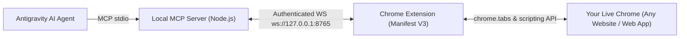

# Antigravity Browser Operator ⚡

> Connects your live Google Chrome browser directly to Antigravity AI Agent (and other MCP clients) without restarting Chrome, bypassing the need for guest profiles or remote debugging flags.

Built with **Manifest V3 Chrome Extension** (`chrome.tabs`, `chrome.scripting`, `chrome.debugger`) and a local **Model Context Protocol (MCP) Server** communicating over an authenticated local WebSocket bridge (`ws://127.0.0.1:8765`).

---

## 🌟 How it Works



Unlike traditional debugging flags (`--remote-debugging-port`), this architecture works seamlessly inside your existing Chrome instance with:
- ✅ **No Chrome restarts required**
- ✅ **Works across ANY website & web application** (Gmail, LinkedIn, GitHub, AWS, ChatGPT, etc.)
- ✅ **All active logins & sessions preserved**
- ✅ **Full session cookies & 2FA intact**
- ✅ **Instant tab switching, clicking, typing, scrolling, and DOM extraction**

---

## 🔒 Security Architecture

To protect your browser against unauthorized local access and malicious websites, the bridge implements multi-layered security controls:

1. **Cryptographic Token Authentication (Shared Secret)**:
   - All connections to the local WebSocket bridge require a 256-bit entropy token.
   - Automatically generated and securely stored at `~/.antigravity-browser-operator/token`.
   - Unauthenticated or invalid connections are dropped immediately (`4001 Unauthorized`).
   - Run `npm run token` to view your security token.

2. **Cross-Site WebSocket Hijacking (CSWSH) Prevention**:
   - Web browsers do not enforce Same-Origin Policy on WebSockets by default. To prevent malicious websites visited in your browser from attempting to connect to `127.0.0.1:8765`, the bridge inspects the `Origin` header.
   - Any connection originating from a web page (`http://` or `https://`) is immediately terminated (`4003 Forbidden`).
   - Only the trusted Chrome Extension origin (`chrome-extension://`) and local Node.js backend processes are permitted.

---

## 🚀 Quick Setup (1 Minute)

### 1. Load the Chrome Extension:
1. Open Google Chrome and go to `chrome://extensions`.
2. Toggle on **Developer mode** (top right corner).
3. Click **Load unpacked** (top left).
4. Select the `extension` folder from this project:
   ```
   C:\Users\r123t\Documents\www\antigravity-browser-operator\extension
   ```
5. You'll see the **⚡ Antigravity Browser Operator** icon appear in your Chrome toolbar.

### 2. Pair with Security Token:
1. Get your security token by running:
   ```bash
   npm run token
   ```
   *(or copy it from `~/.antigravity-browser-operator/token`)*
2. Click the **Antigravity Browser Operator** icon in Chrome.
3. Paste the token into the **Security Token** field and click **Save Token**.
4. The status badge will turn green: **Connected** and **Authenticated**.

---

## 🛠️ MCP Tools Provided

| Tool Name | Description |
|-----------|-------------|
| `browser_list_tabs` | Returns all open tabs across your Chrome windows (ID, title, URL, active state). |
| `browser_select_tab` | Focuses / switches to a specific tab by ID. |
| `browser_navigate` | Navigates the current tab to any URL and waits for page load. |
| `browser_click` | Clicks elements using CSS selectors or visible text. |
| `browser_type` | Types into input / text fields with optional Enter keypress. |
| `browser_get_dom` | Extracts title, URL, visible text, and HTML snippet. |
| `browser_screenshot` | Captures visible screenshot of any tab. |
| `browser_scroll` | Scrolls tab up or down smoothly. |
| `browser_evaluate` | Executes arbitrary JavaScript inside the page context. |
| `browser_new_tab` | Opens a new tab with a given URL. |
| `browser_close_tab` | Closes any specific tab. |

---

## 📄 License
MIT © Hashan Walauwatta
